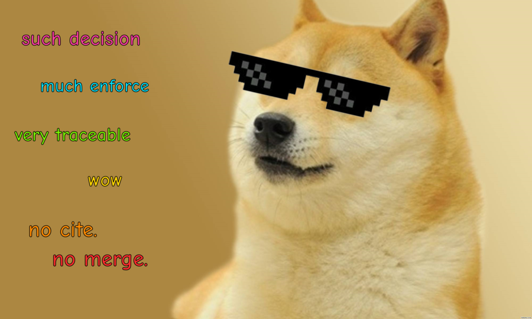

# 🐕 dogma

An architectural decision record system which prevents spec drift _without_
opinions on how to author specs.

Written specifications drift from reality, and the discipline that would stop
them can't be gated in CI without turning every open pull request red.

*Arriving from [OpenSpec](https://github.com/Fission-AI/OpenSpec)? See
[why dogma diverged](#coming-from-openspec).*

  

---

## 🚶 Workflow

A service with a spec and no dogma yet. The defaults already enforce `specs/**`,
so there is nothing to configure:

```
my-service/
├── specs/
│   └── auth.md
├── src/
│   └── session.rs
└── Cargo.toml
```

**1. You need to change behaviour.** Sessions expire too aggressively. Record
the decision before touching anything:

```console
$ dogma new "session lifetime"
.dogma/decisions/26/09/02-session-lifetime.md

Cite it from the commit that acts on it:
    Decision: 26-09-02-session-lifetime
```

```
my-service/
├── .dogma/
│   └── decisions/26/09/02-session-lifetime.md   ← new, status: proposed
├── specs/auth.md
└── src/session.rs
```

**2. Fill it in.** The scaffold's sections are the argument, not paperwork —
*Alternatives* is where a real decision proves it was one:

```markdown
---
status: proposed
title: session lifetime
---

## Context
Support sees ~40 tickets a month from users logged out mid-form.

## Decision
Idle sessions expire after 8 hours rather than 30 minutes.

## Alternatives
Sliding expiry on every request — rejected, it never expires an abandoned
session on a shared machine. Remember-me checkbox — rejected for now, it moves
the decision to users who cannot assess it.

## Consequences
A stolen session token is useful for longer. Revisit if we add device
management, which would give us a better lever than the clock.
```

**3. Do the work, and cite it.** Spec and code in one commit, or several — only
the merged result has to hold together:

```console
$ git commit -am "Expire idle sessions after 8 hours

Decision: 26-09-02-session-lifetime"
```

Forget the trailer and the gate says so:

```console
$ dogma check
✗ specs/auth.md changed in a1b2c3d with no decision cited
exit 1
```

**4. Review, then accept.** Reviewers argue with the *decision*, not just the
diff. When it lands, one word changes:

```diff
-status: proposed
+status: accepted
```

```console
$ dogma check
✓ decisions well-formed (1)
✓ enforce patterns match
✓ 1 enforced change cites an accepted decision
```

**5. Six months later**, someone asks why sessions last so long:

```console
$ dogma why specs/auth.md:12
26-09-02-session-lifetime  (accepted)  session lifetime

$ dogma impact 26-09-02-session-lifetime
a1b2c3d  Expire idle sessions after 8 hours
         specs/auth.md
         src/session.rs
```

Nobody maintained that link. It is the commit.

<a id="design"></a>

## ⚖️ Design

Dogma enforces one thing:

> **a commit that changes an enforced path must cite an accepted decision.**

That's the whole design. It is green during normal work — commits that touch
nothing enforced are unaffected — and it fails only when someone changes
something significant without recording why.

From that single edge you get a traceability graph in which every link is a
commit fact, so nothing can drift out of date:

```
decision ──cited by──> commits ──contain──> spec changes
                          └──────────────> code changes
```

| question | command |
|---|---|
| why is this line here? | `dogma why specs/auth.md:42` |
| what did that decision cause? | `dogma impact 26-09-02-git-is-the-lifecycle` |
| what did we agree and never build? | `dogma gaps` |
| is this branch compliant? | `dogma check main..HEAD` |

### Citing without enforcing

`enforce` decides where a *missing* citation is an error. It does not decide
where citations work — those work everywhere, always.

Any commit may carry a trailer, whether or not it touches an enforced path:

```
Fix session expiry off-by-one

Decision: 26-09-02-session-lifetime
```

Nothing required that citation. But `why` and `impact` never consult `enforce`
at all, so it is traced like any other:

```console
$ dogma why src/session.rs:88
26-09-02-session-lifetime  (accepted)  Expire idle sessions after 8 hours
```

So the useful pattern is to enforce the few paths where a silent change would
actually hurt, and let people cite freely everywhere else. Traceability into
code becomes opt-in rather than imposed: no gate demands it, and every developer
who bothers makes the record better. `dogma impact` then shows the code that
implemented a decision alongside the specs that describe it.

Because the link is a commit trailer rather than an annotation in the source, it
survives refactors — git already tracks lines across moves and renames, which is
what makes this durable where `// see spec: auth.md` comments are not.

<details>
<summary>Enforcing everything, if you want the strict version</summary>

```toml
enforce = ["**", "!vendor/**", "!**/*.generated.rs"]
```

Then citation stops being optional anywhere, and every line in the repository is
guaranteed to trace to a decision rather than merely able to. This is what
traceability standards demand — DO-178C in aerospace, IEC 62304 in medical
devices — and what six-figure ALM suites exist to provide.

The honest cost is chore pressure. Dependency bumps, formatting passes and
generated files have no decision behind them, so you end up either growing the
exemption list forever or minting a routine-maintenance decision that everything
cites, which is a rubber stamp wearing a lanyard.

</details>

## 🔧 Concepts

### Decisions

A decision is a markdown file with a short YAML frontmatter. It lives at a path
derived from its id:

```
.dogma/decisions/26/09/02-git-is-the-lifecycle.md     id: 26-09-02-git-is-the-lifecycle
```

**The id is the path.** Splitting `26-09-02-git-is-the-lifecycle` on `-` gives
you the directory and filename directly, so there is no lookup table that could
disagree with the filesystem. There is also no counter, which means two people
on separate branches can never collide over the next number — a well-known
annoyance with numbered ADRs.

The date makes ids self-describing in `git log`, and lets a slug be reused
years later without ambiguity.

### Status

```
proposed ──(edit during review)──> accepted
                                └─> rejected
```

Status is edited exactly once, by hand, in the file you're already reviewing.
Only `accepted` satisfies the gate.

**Supersession is not a status.** A later decision declares it:

```yaml
status: accepted
supersedes: 26-09-02-git-is-the-lifecycle
```

The superseded decision is never touched. It stays `accepted`, because it *was* —
decisions are events, and commits that cited it were correct at the time.
"Superseded" is derived by following the link backwards.

### Enforced paths

Only `.dogma/` belongs to the tool. Everything it watches lives wherever your
team already keeps it, because dogma doesn't own those files — `enforce` is
just a list of globs.

The tool has no concept of a "spec". It knows *enforced paths*, and "spec" is
your word for whatever you chose to enforce. Point it at `schema/`, `proto/` or
`infra/terraform/` and nothing about its behaviour changes.

### The citation

The only mechanical link between a decision and the work it justifies is a
commit trailer:

```
Expire idle sessions after 8 hours

Decision: 26-09-02-session-lifetime
Refs: QUA-1574
```

Note what this means: **a decision never lists the specs it affects, and a spec
never cites its decision in its text.** Both would be hand-maintained derived
data — exactly the thing that rots. The join lives in git.

Issue trackers meet the same way. Git already carries `Refs:` trailers, so
`dogma impact` surfaces the tickets alongside the files without dogma knowing
your tracker exists.

### Code and specs

Code and specs are linked by **co-citation**: they changed together, in commits
citing the same decision. `dogma impact` shows both sides, and `dogma why`
works on source files as readily as on specs.

What this deliberately does *not* do is tell you that a particular function
implements a particular requirement. That needs annotations in code, and
annotations rot on the first refactor. Commit-level traceability is free and
durable; requirement-level correspondence is unsolved by every tool in this
space, and dogma doesn't pretend otherwise.

## ⌨️ Commands

```
dogma new <title>            create a decision, dated today, status: proposed
dogma list                   decisions and their statuses, oldest first
dogma check [range]          the gate
dogma gaps                   where the record and reality have come apart
dogma why <file>[:<line>]    what decided this
dogma impact <id>            what this decided
```

`--help` is the documentation. Dogma writes nothing into your repository — no
generated instruction files, no per-editor adapters — so there is nowhere else
for its behaviour to be described.

### `check`

The gate. Verifies three things:

1. every commit in the range touching an enforced path cites a decision
2. every cited decision exists and is `accepted`
3. the decisions directory is well-formed, and every `enforce` pattern matches
   something — a typo there would otherwise disable the gate *while leaving it
   green*, which is the worst failure a gate can have

```
$ dogma check main..HEAD
✓ decisions well-formed (12)
✓ enforce patterns match
✓ 3 enforced changes cite accepted decisions

  14 enforced files have no decision behind them  → dogma gaps
   2 accepted decisions are unimplemented         → dogma gaps
```

| exit | meaning |
|---|---|
| 0 | every enforced change cites an accepted decision |
| 1 | a violation |
| 2 | usage or environment error |

A decision's status is read at the **head of the range**, not at the citing
commit. So proposing and implementing in one PR works: the decision goes in as
`proposed`, is flipped to `accepted` during review, and the tree is coherent at
merge. The gate asks whether *this state* holds together, not whether every
intermediate commit did.

### `gaps`

Always exits 0. This is a report, never a gate — and that is deliberate. Every
repo adopting dogma has pre-existing files with no decision behind them, and
folding those into `check` would recreate the permanent-red problem the tool
exists to avoid. `check` surfaces the counts and points here; `gaps` does the
listing.

## ⚙️ Configuration

Optional. `.dogma/config.toml` or `dogma.toml`:

```toml
decisions = ".dogma/decisions"
enforce   = ["specs/**", "!specs/drafts/**"]
trailer   = "Decision"
```

An unknown key is an error rather than a silent no-op, for the reason above.

`enforce` patterns are evaluated in order and **the last match wins**, the same
rule `.gitignore` uses, so `!pattern` carves exceptions out of a broader sweep.

See [Design](#design) for what enforcing the whole repository buys you.

**The decisions directory is never enforced**, whatever the config says. A
repository that enforced its own decisions could not add one: the commit would
need to cite an accepted decision, and a new decision is born `proposed`. The
exclusion is in code rather than left to the user, so the lockout is impossible
rather than one typo away.

**Not configurable:** the statuses, and which of them satisfies the gate. If
those varied per repo, `dogma check` would mean something different in each
one.

## 🤖 Working with agents

Decision records turn out to be a good fit for LLM-assisted development, for
two reasons beyond governance.

**The cost objection disappears.** The historical problem with decision records
is that nobody writes them. When the agent that reasoned through a choice
drafts the record from that same session, the marginal cost is near zero — the
reasoning already exists, it just needs somewhere durable to land.

**They transfer context between sessions.** An agent session ends and its
reasoning evaporates. Decisions live in the checkout, so any agent with the
repo can read them — offline, greppable, no API. `dogma why specs/auth.md`
returns the reasoning behind the thing an agent is about to modify.

One caveat worth designing against: a hollow record written by a human is two
terse lines you can spot. A hollow record written by a model is three fluent
paragraphs that restate the change and decide nothing. The scaffold's sections
— *Alternatives*, and *what would make us revisit* — are chosen to be
conspicuous when empty.

## 🚫 What it deliberately does not do

- **Stores nothing.** No index, no lockfile, no cache. Every answer is derived
  from git and the working tree at the moment you ask, so no state can go stale.
- **Writes nothing into your repo.** Beyond decisions you asked it to create.
- **Enforces no format.** The only thing it parses is a decision's frontmatter,
  because that is the only thing it reads. Specs are written however your team
  likes — prose, tables, Gherkin, diagrams.
- **Manages no lifecycle.** Git is the lifecycle. Branches are proposals, merges
  are acceptance, history is the archive. Two changes touching the same
  requirement produce a merge conflict, surfaced by git and resolved by a human,
  which is correct.
- **Integrates with nothing.** No tracker APIs, no forge plugins, no per-tool
  adapters.

See [`.dogma/decisions/26/09/02-git-is-the-lifecycle.md`](.dogma/decisions/26/09/02-git-is-the-lifecycle.md)
for the reasoning, including the alternatives that were rejected.

<a id="coming-from-openspec"></a>

## 🧭 Coming from OpenSpec

Dogma exists because of a specific problem in [OpenSpec](https://github.com/Fission-AI/OpenSpec),
and if you're arriving from there, this is the disagreement in full.

OpenSpec keeps a `changes/<name>/` directory per change, holding delta specs —
`## ADDED` / `## MODIFIED` blocks — which `openspec archive` later folds into
the main specs while moving the folder into `changes/archive/`.

That directory is **two things at once**: a *record* of why something was done,
and a pending *operation* waiting to be applied. Everything else follows from
that conflation:

- An operation must be applied exactly once, so it needs a moment — and on a
  team with code review, no moment works. During review, feedback invalidates
  the fold and there's no un-archive. After merge, a bot commits to a protected
  branch. At approval, most forges have no trigger.
- Because the moment can't be scheduled, the discipline can't be gated in CI
  without the check being red for the entire life of every change.
- And if an operation is never retired, it stays live. Two changes touching the
  same requirement then fight: re-applying the older one overwrites the newer
  text, and the check sticks red with no way to clear it.

Dogma's answer is to stop having operations. Specs are edited directly; git
carries the diff, the ordering, the merge and the history. Decisions are a
separate append-only record, joined to the work by a commit trailer.

| | OpenSpec | dogma |
|---|---|---|
| spec edits | deltas in a change folder, folded later | edited directly, in the branch |
| history | `changes/archive/` | git |
| ordering & merge | the fold engine | git merge, conflicts included |
| lifecycle state | `status`, directory position | none — branches and merges are the lifecycle |
| the filing step | `openspec archive` | doesn't exist |
| what it stores | specs, changes, archive | decisions only |

**What OpenSpec has that dogma does not**, and these are real:

- **A guided authoring workflow.** The propose → specs → design → tasks artifact
  graph, with schema-driven instructions per phase. That's the bulk of what
  OpenSpec *is*, and dogma has no equivalent — it assumes you know what you want
  to write.
- **A spec grammar and validator.** Requirements, scenarios, and a strict mode.
  Dogma parses nothing but a decision's frontmatter, deliberately.
- **Multi-repo stores.** Planning that lives in its own repo, referenced by code
  repos.
- **AI tool adapters.** Generated skills and instructions for a dozen editors.

If you want the guided workflow, use OpenSpec — the two aren't competing for the
same job. Dogma does one thing: it makes sure consequential changes carry a
recorded reason, and lets you ask about it afterwards.

You can also use both. `openspec validate --specs --strict` runs standalone with
no `changes/` directory, so nothing stops you keeping OpenSpec's spec grammar
and letting git handle the lifecycle.

The upstream discussion is
[Fission-AI/OpenSpec#1683](https://github.com/Fission-AI/OpenSpec/issues/1683)
and [#1684](https://github.com/Fission-AI/OpenSpec/pull/1684), which proposed
fixing this inside OpenSpec before we concluded the fix was a different tool.

## 🚧 Status

Early. The CLI surface is settled and `new` works; `check` is next, then the
query commands.

## 📜 Licence

MIT OR Apache-2.0
